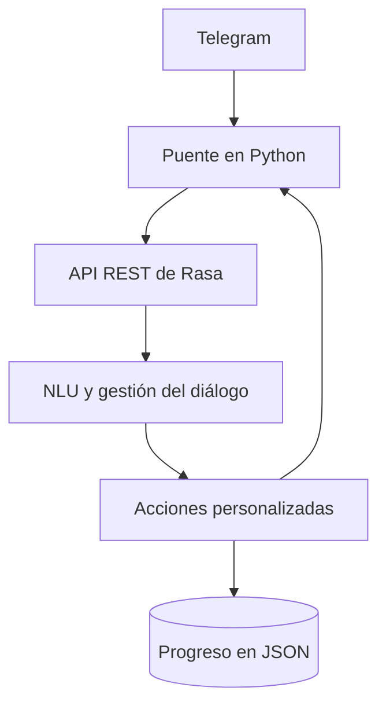

# CodeBot

**Asistente educativo conversacional para el aprendizaje de programación en C**

CodeBot es un chatbot educativo desarrollado como Trabajo Fin de Grado en la Escuela Técnica Superior de Ingenieros Industriales de la Universidad Politécnica de Madrid (ETSII UPM). Está dirigido principalmente a estudiantes que se inician en la programación en C y permite consultar teoría, practicar mediante minitests y seguir ejercicios resueltos paso a paso desde Telegram.

El sistema se ha desarrollado con Python y Rasa. Emplea técnicas de comprensión del lenguaje natural (NLU), reglas de diálogo, acciones personalizadas y almacenamiento local en archivos JSON. La versión incluida en este repositorio corresponde a la **versión 18**, versión definitiva validada para el TFG.

## Funcionalidades principales

- Consulta de teoría organizada por temas.
- Minitests con corrección automática, puntuación y feedback explicativo.
- Recomendaciones de estudio en función de los resultados obtenidos.
- Ocho ejercicios guiados de programación en C explicados paso a paso.
- Consulta del progreso individual del usuario.
- Registro local de minitests y ejercicios consultados mediante archivos JSON.
- Interfaz en Telegram con menús y teclados adaptados al contexto.
- Gestión de consultas no reconocidas mediante un mecanismo de *fallback*.

## Temario incluido

| Número | Tema |
| ---: | --- |
| 0 | Introducción a la programación |
| 1 | Variables y tipos de datos |
| 2 | Entrada y salida |
| 3 | Operadores |
| 4 | Condicionales |
| 5 | Bucles |
| 6 | Funciones |
| 7 | Arrays |
| 8 | Strings |
| 9 | Punteros |
| 10 | Estructuras (`structs`) |

## Arquitectura



El archivo `telegram_bridge.py` recibe los mensajes enviados por Telegram mediante *polling*, los normaliza y los remite al conector REST de Rasa. El modelo identifica la intención del usuario y gestiona el diálogo. Cuando una interacción requiere lógica adicional, como un minitest, un ejercicio guiado o la consulta del progreso, se ejecutan las acciones definidas en `actions/actions.py`.

## Estructura del repositorio

```text
codebot-tfg/
├── actions/
│   └── actions.py                 # Acciones, minitests y ejercicios guiados
├── data/
│   ├── nlu.yml                    # Ejemplos de entrenamiento del NLU
│   ├── rules.yml                  # Reglas conversacionales
│   └── stories.yml                # Historias de conversación
├── validacion/                    # Hojas de cálculo de las pruebas finales
├── config.yml                     # Pipeline de NLU y configuración de Rasa
├── credentials.yml                # Configuración de canales
├── domain.yml                     # Intents, entidades, slots, respuestas y acciones
├── endpoints.yml                  # Conexión con el servidor de acciones
├── requirements.txt               # Dependencias del proyecto
├── telegram_bridge.py             # Puente entre Telegram y Rasa
└── README.md                      # Documentación principal
```

Los directorios del entorno virtual, los modelos entrenados y los archivos temporales de Rasa no se almacenan en el repositorio.

## Requisitos

- Python 3.10.
- Rasa 3.6.21.
- Rasa SDK 3.6.2.
- Biblioteca `requests` 2.32.5.
- Una cuenta de Telegram y un bot creado mediante BotFather para utilizar la interfaz de Telegram.

## Instalación

1. Clonar el repositorio:

   ```bash
   git clone https://github.com/mariaayalaupm/codebot-tfg.git
   cd codebot-tfg
   ```

2. Crear y activar un entorno virtual:

   ```bash
   python -m venv .venv
   ```

   En Windows PowerShell:

   ```powershell
   .\.venv\Scripts\Activate.ps1
   ```

3. Instalar las dependencias:

   ```bash
   python -m pip install --upgrade pip
   pip install -r requirements.txt
   ```

4. Entrenar el modelo:

   ```bash
   rasa train
   ```

## Ejecución

La aplicación necesita tres procesos en ejecución. Deben iniciarse desde la raíz del proyecto y con el entorno virtual activado.

1. Iniciar el servidor de acciones personalizadas:

   ```bash
   rasa run actions
   ```

2. En otra terminal, iniciar Rasa con la API habilitada:

   ```bash
   rasa run --enable-api
   ```

3. En una tercera terminal, iniciar el puente con Telegram:

   ```bash
   python telegram_bridge.py
   ```

También se puede probar el asistente directamente en consola mediante:

```bash
rasa shell
```

## Configuración de Telegram

Para utilizar la interfaz de Telegram es necesario disponer de un token generado mediante BotFather. El token es una credencial privada y no debe incluirse directamente en el código ni almacenarse en el repositorio.

Antes de ejecutar el puente, debe definirse el token mediante una variable de entorno. En Windows PowerShell:

```powershell
$env:TELEGRAM_BOT_TOKEN="TOKEN_DEL_BOT"
python telegram_bridge.py
```

## Validación

La versión definitiva se evaluó mediante una campaña exhaustiva formada por **711 pruebas distribuidas en 13 hojas**, seguida de una revalidación funcional, de regresión y del modelo NLU sobre la versión 18.

Los registros completos se encuentran en la carpeta [`validacion`](validacion/), junto con una descripción de los archivos incluidos.

## Privacidad y seguridad

Los archivos `progreso_alumnos.json` y `progreso_ejercicios_guiados.json` se generan automáticamente durante el uso del sistema y pueden contener identificadores y datos asociados a usuarios de Telegram.

Por este motivo, ambos archivos están excluidos del repositorio mediante `.gitignore`. Las credenciales y los tokens también se gestionan fuera del código fuente.

## Autoría

**María Ayala Peraza**  
Trabajo Fin de Grado, ETSII UPM, 2026.

Este repositorio recoge el código fuente y el material de validación de CodeBot con fines académicos.
